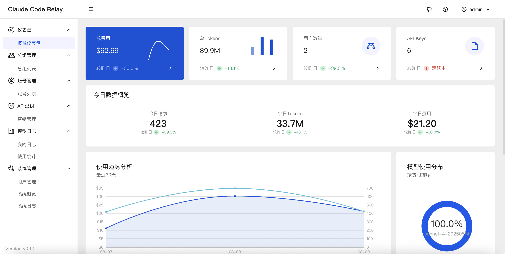
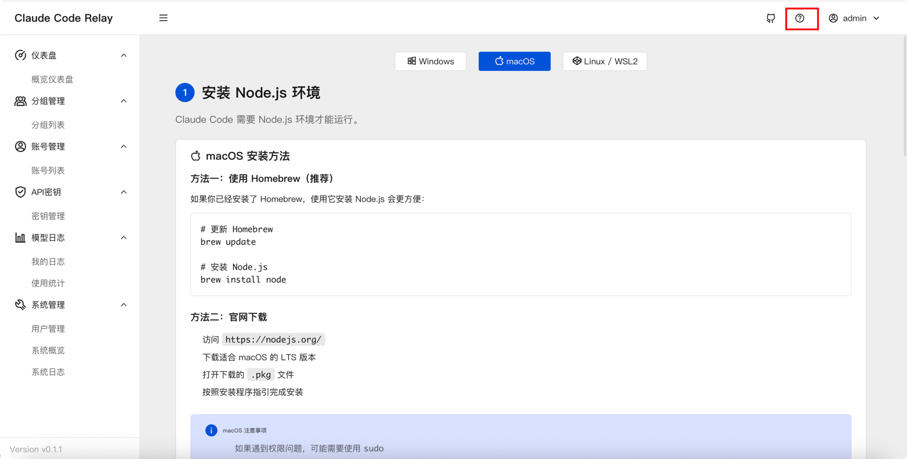

# Claude Code Relay

<div align="center">


[](https://opensource.org/licenses/MIT)
[](https://nodejs.org/)
[](https://redis.io/)
[](https://www.mysql.com/)
[](https://www.docker.com/)

基于Go + Gin的Claude Code 镜像中转服务，采用分层架构设计。支持多账号池管理、智能负载均衡、API Key分发、使用统计和成本计算。包含完整的Vue 3管理界面，基于TDesign组件库。   

**如果此项目对您有所帮助, 请帮我点个 ⭐️ 吧~**   

[英文文档](README_EN.md) • [中文文档](README.md)   

</div>

---




## ⚠️ 重要提醒
使用本项目前请仔细阅读：

🚨 服务条款风险: 使用本项目可能违反Anthropic的服务条款。请在使用前仔细阅读Anthropic的用户协议，使用本项目的一切风险由用户自行承担。    

📖 免责声明: 本项目仅供技术学习和研究使用，作者不对因使用本项目导致的账户封禁、服务中断或其他损失承担任何责任。    

## 💡 能得到什么?

与三五个好友一起拼车使用 `Claude Code` 账号, 同时也可以作为多个 "车主" 为不同的用户提供服务.   

支持任意符合 `Claude Code` API规范的账号池, 如: `GLM4.5` `Qwen3-Code`等, 甚至一些国内的中转镜像站的 `Claude Code` 专属分组均可, 这样就能实现在账号限流的时候智能切换.   

同时提供了完整的使用统计和成本计算 (**与实际会有略微差异**), 让你清楚了解每个账号的使用情况和费用支出, 以及为每个Api Key设置每日限额.     

### 支持接入的平台类型
- ✅ 支持添加 Claude 官方账号 (需Pro及以上订阅版本)
- ✅ 支持添加任意 Claude Code 的镜像接口 (官方镜像站/智谱/通义千问等)
- ✅ 支持任意符合 OpenAI API 格式的接口

## ✨ 核心特性

**后端服务**
- 多账号池统一管理，智能负载均衡
- 支持Claude官方API和Claude Console双平台
- 基于权重和优先级的智能调度算法
- 完整的Token使用统计和成本计算
- 分层架构设计（Controller-Service-Model）
- 完整中间件链（Auth、CORS、限流、日志等）
- 账号请求异常自动禁用, 定时检测自动恢复
- API Key支持每日限额和可用模型配置

**前端界面** 
- Vue 3 + TypeScript + TDesign组件库
- 实时数据统计和可视化图表
- 完整的权限管理和用户系统
- 单独的API KEY的用量查询 (`/stats/api-key?api_key=sk-xxx`)

## 🏗 项目架构

**后端分层结构**
```
├── controller/     # HTTP请求处理、参数验证、响应格式化  
├── service/        # 核心业务逻辑、账号调度、使用统计
├── model/          # 数据模型定义、GORM操作
├── middleware/     # 认证、限流、日志、CORS
├── relay/          # Claude API中转层
├── common/         # 工具函数、成本计算、JWT处理
└── router/         # 路由配置
```

**前端项目结构**
```
web/
├── src/
│   ├── pages/      # 业务页面组件
│   ├── components/ # 公共组件
│   ├── api/        # API请求封装
│   ├── store/      # Pinia状态管理
│   ├── router/     # Vue Router路由
│   └── utils/      # 工具函数
├── package.json    # 依赖配置
└── vite.config.ts  # Vite配置
```

## 🚀 快速开始

### 环境要求
- Go 1.21+
- Node.js 18.18.0+ (前端开发)
- MySQL 5.7+
- Redis

## 📋 核心API
- [Apifox在线文档](https://s.apifox.cn/ba2f5ebd-5a13-4e3a-9c42-628208b1d09f) 涵盖了大部分接口

## 🏗 设计架构

### 后端分层设计
- **Controller层**: 请求处理、参数验证、响应格式化
- **Service层**: 业务逻辑、账号调度、统计计算
- **Model层**: 数据模型、数据库操作、CRUD接口
- **Middleware层**: 认证、限流、CORS、日志记录
- **Scheduled层**: 处理账号状态检测、自动恢复异常账号 

### 智能调度算法
1. **优先级排序**: 数字越小优先级越高
2. **权重选择**: 同优先级中按权重比例选择
3. **状态过滤**: 仅选择正常状态的账号
4. **故障转移**: 自动跳过异常账号

### 技术栈
1. **后端**: Go 1.21+, Gin, GORM, Redis  
2. **前端**: Vue 3.5+, TypeScript, TDesign, Vite 6+  
3. **数据库**: MySQL 5.7+, Redis  

## 💻 开发说明

### 后端开发规范
- **分层原则**: Controller → Service → Model
- **错误处理**: 使用 `common.SysLog()` 和 `common.SysError()`
- **用户信息获取**: 使用 `user := c.MustGet("user").(*model.User)`
- **依赖管理**: 添加新依赖后运行 `go mod tidy`

### 前端开发规范
- **组件样式**: 必须声明 `<style scoped>`  
- **API请求**: 统一使用 `@/utils/request` 封装的axios  
- **代码检查**: 提交前自动运行lint检查   
- **文档参考**: [TDesign Vue3文档](https://tdesign.tencent.com/vue-next/)  

### 数据库规范
**核心数据表**
- `users` - 用户账户和角色权限
- `accounts` - Claude账号池和使用统计  
- `api_keys` - API密钥管理和使用监控
- `groups` - 分组管理和权限控制
- `logs` - 模型请求日志记录数据  
- `api_logs` - API请求日志和统计数据

## 🐳 部署指南

### Docker部署（推荐）

**一键部署全套服务**
```bash
# 启动MySQL + Redis + 应用
docker-compose -f docker-compose-all.yml up -d

# 查看服务状态
docker-compose -f docker-compose-all.yml ps

# 访问地址
echo "应用地址: http://localhost:10081"
echo "默认管理员: admin / admin123"
```

**使用现有数据库**
```bash
# 复制并编辑环境变量
cp .env.example .env

# 启动应用
docker-compose up -d
```

### 二进制部署

可以在 [Releases](https://github.com/RipperTs/claude-code-relay/releases) 页面直接下载最新的二进制文件, 或者按照下面方式自行编译构建。

**构建多平台版本**
```bash
# 使用Makefile构建
make build

# 查看构建产物
ls out/
```

**生产环境启动**   

将 [.env.example](.env.example) 文件复制为 `.env` 文件，并根据实际情况修改配置。   

然后放置在与 `claude-code-relay` 二进制文件同一目录下。   

```bash
# 设置必需环境变量
export SESSION_SECRET=$(openssl rand -base64 32)
export JWT_SECRET=$(openssl rand -base64 32)
export SALT=$(openssl rand -base64 16)
...

# 配置数据库
export MYSQL_HOST=your-host
export MYSQL_USER=your-user
export MYSQL_PASSWORD=your-password
...

# 启动服务
./claude-code-relay
```

**生产环境前端启动**
```bash
# 进入前端目录
cd web

# 安装依赖 (推荐使用pnpm)
pnpm install

# 新增.env 文件, 参考 .env.development 配置
cp .env.development .env
vi .env # 修改 VITE_API_URL 为你的后端地址

# 构建生产版本
pnpm run build

# 部署到服务器即可
```

## 💐 如何在ClaudeCode中使用此服务?

在ClaudeCode中使用此服务非常简单，只需将 Claude Code 的请求地址换成此服务地址和秘钥即可。以下是具体步骤：  

```bash
# 在ClaudeCode中配置API请求地址 (建议开启https)
export ANTHROPIC_BASE_URL=https://your-server-domain/claude-code

# 在ClaudeCode中配置API密钥
export ANTHROPIC_AUTH_TOKEN="你的API密钥"
```

另一种方法, 创建并配置 Settings 文件： 在 ~/.claude/settings.json 文件并配置您的 API 密钥: 
```json
{
  "env": {
    "ANTHROPIC_AUTH_TOKEN": "your-api-key-here",
    "ANTHROPIC_BASE_URL": "https://your-server-domain/claude-code",
    "CLAUDE_CODE_DISABLE_NONESSENTIAL_TRAFFIC":1

  },
  "permissions": {
    "allow": [],
    "deny": []
  },
  "apiKeyHelper": "echo 'your-api-key-here'"
}
```

**更加详细的方法, 进入到后台页面, 点击右上角 `帮助文档` 或者直接访问页面 `/help/index` 地址, 有更加详细的使用教程.**   



## ❓ 常见问题

**Q: 如何重置管理员密码？**  
A: 删除数据库中的admin用户记录，重启服务会自动重新创建默认管理员。

**Q: 支持哪些Claude模型？**  
A: 支持所有Claude模型，包括Claude-3.5系列，成本计算会自动适配不同模型。

**Q: 如何查看账号使用统计？**  
A: 通过前端管理界面或API接口查看详细的使用统计和成本分析。

**Q: 无法正常访问Claude官方服务？**  
A: Claude等国外模型服务商禁用国内IP访问, 自行使用代理解决 (建议使用高质量的代理IP)。


## 🤝 鸣谢
- 灵感来源: [claude-relay-service](https://github.com/Wei-Shaw/claude-relay-service)
- 本项目 **90%** 代码均由 [Claude Code](https://www.anthropic.com/claude-code) 开发完成, 感谢Anthropic提供强大的AI能力支持.

---

## 📄 许可证

[MIT License](LICENSE) - 欢迎贡献代码和提交Issue！